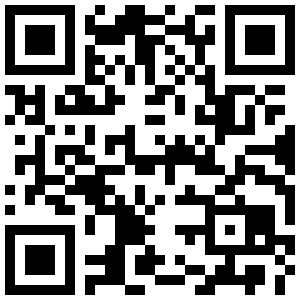

[](https://travis-ci.org/samwierema/go-qr-generator)

# Echo Golang QR code generator
Starts an Golang server (listening on port 8080) that generates QR codes. Once installed and running (see below), the service accepts the following two parameters:
* ```data```: (Required) The (URL encoded) string that should be encoded in the QR code
* ```size```: (Optional) The size of the image (default: 250)

E.g. ```http://localhost:8080/?data=1JAQcb8Q2RQXniwX4We1wT6rfAAkBER5tP&size=300```




## Installation
Download the source code and install it using the `go run main.go` command.

## References
* Barcode Library: https://github.com/boombuler/barcode
* Fork from: [go-qr-generator](https://github.com/samwierema/go-qr-generator)
